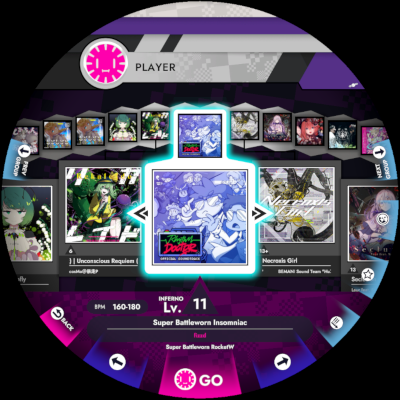
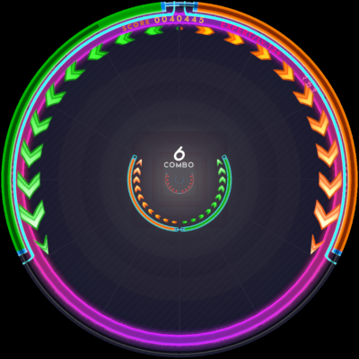

# Saturn-Touch 

[[简体中文](https://github.com/Sky-ey/Saturn-Touch/blob/main/README_ZH.md)] [[English](https://github.com/Sky-ey/Saturn-Touch/blob/main/README.md)]

***

Saturn-Touch 是基于 Unity Input Manager 的 [Saturn](https://github.com/Yasu3D/Saturn) 触摸支持

注意： Saturn-Touch 不仅仅是触摸支持，它还包含一些其他修改！

### 支持功能
- 基础触摸支持
- 多语言
- 玩家信息自定义（WIP）

### 可用平台
- Windows 
  - x64 ***(已测试)***
  - Arm64 ***(已测试)***
- 安卓 ***(已测试)***
- IOS ***(未测试)***

### 推荐使用
- 带有原生触摸屏的 Windows
- Sunshine + Moonlight ***(非鼠标模式和触控板模式)***
- 安装了 Windows on ARM 的平板电脑
- 高性能的安卓设备（平板）

***
# Saturn 

Saturn 是一个为街机硬件开发的开源游戏，由 [Yasu](https://github.com/Yasu3D) 和 [cg505](https://github.com/cg505) 从零开始开发

 

**Saturn 处于 Alpha 开发阶段** 一切都可能会改变

**Saturn 开发者不对你的硬件或其他任何东西造成的损害负责** 我们相信 Saturn 是安全的，并在我们自己的机台上运行过，但我们不为此担保

## 功能
- 加载自己的曲目
- 游戏完全可玩
- 完全支持硬件原生输入和 LED
- 精确的谱面流速和偏移设置
- 为Wacca玩家预调的设置（选项 -> 游戏设置 -> 偏移模式 -> 经典）
- 用于歌曲选择和设置调节的菜单

##### 尚不支持的功能：
- 记录你的分数
- 用户数据存储或在线游戏
- 多人游戏

## 安装 Saturn

### 步骤 1：准备你的设备
按照 [The DiVER's Guide at reDIVE](https://redive.world/guide.html) 指南在你的设备上安装 Windows

### 步骤 2：下载 Saturn
你可以在 [GitHub Release页面](https://github.com/Yasu3D/Saturn/releases) 下载 Saturn 的最新版本，或者下载 [Saturn-Touch ](https://github.com/Sky-ey/Saturn-Touch/releases)

你可以直接在你的设备上上下载，也可以下载到任何移动存储设备并将其拷贝到机台上

下载完成后请先在机台上完全解压缩`.zip`文件，解压缩到哪里并不重要

### 步骤 3：获取歌曲
有关如何存储歌曲的更多信息，请参阅下面的 [SongPack 格式](#songpacks-format) 如果你不知道在哪里获取歌曲，很遗憾你并不能从这里得到答案

确保每首歌都有一个 `meta.mer` 文件，以及至少一个名为 0.mer、1.mer、2.mer、3.mer 或 4.mer 的文件确保所有歌曲都在游戏目录下的 `SaturnGame_Data/Assets/StreamingAssets/SongPacks` 文件夹中

### 步骤 4：运行 Saturn
运行 SaturnGame.exe 开始游戏，Enjoy it ！

### 替代方案
- 如果你已经有一个安装好的 Windows ，你可能可以直接解压运行 Saturn，而无需安装新的Windows
- Saturn 在 Linux 上也运行良好，尽管这在机台上尚未经过全面测试如果你试过了，请告诉我们！

## SongPacks 格式
Saturn 从 `SaturnGame_Data/Assets/StreamingAssets/SongPacks` 文件夹中读取歌曲

### 文件夹布局
每首歌及其谱面必须在自己的文件夹内你可以随意命名歌曲文件夹以帮助保持文件格式

在 Saturn 中，歌曲根据所在的父文件夹进行分组，因此你可以将相关歌曲放在同一文件夹中

### 歌曲文件夹内容
> _我们将在未来转移到一种更适合 Saturn 的新格式因此，以下说明是暂时的_

歌曲文件夹必须使用 [wack 格式](https://github.com/muskit/wack-format)，并且谱面有一些额外的文件名限制：
- 谱面文件只能使用 `0.mer` 到 `4.mer` 作为文件名，歌曲信息文件应该改名为 `meta.mer`
  - `0.mer` 将是Normal难度
  - `1.mer` 将是Hard难度
  - `2.mer` 将是Expert难度
  - `3.mer` 将是Inferno难度
  - `4.mer` 将是Beyond难度（新）
- 每首歌只需要至少一个难度，无需全难度
- 你必须严格遵守命名规范，否则你将看不到你自己的歌曲
- 同一首歌上最多可以有 5 个谱面

如果你正在使用 [MercuryMapper](https://github.com/Yasu3D/MercuryMapper)，可以选择为 Saturn 导出

### 将谱面转换为 wack 格式
如果你有一个你想在 Saturn 中使用的谱面，但它不是wack格式，你可以根据以下步骤转化

1. 为歌曲创建一个新文件夹，并复制谱面、音频和封面

2. 将封面重命名为 `jacket.png` 或 `jacket.jpg` 将谱面文件重命名为 `0.mer`、`1.mer`、`2.mer`、`3.mer` 或 `4.mer`，根据难度命名

3. 以文本模式编辑谱面文件添加所有必要的标签，你可以在记事本或其他文本编辑器中打开谱面，并在文件开始处，添加如下内容：
   ```
   #--- BEGIN WACK TAGS ---
   #LEVEL <难度>
   #AUDIO <音频文件名>
   #CLEAR_THRESHOLD 0.8
   #AUTHOR <谱面作者名>
   #PREVIEW_TIME <预览开始时间>
   #PREVIEW_LENGTH <预览时长>
   #--- END WACK TAGS ---
   ```
   `BEGIN WACK TAGS` 和 `END WACK TAGS` 行是可选的

   通常 `CLEAR_THRESHOLD` 根据难度决定：Normal难度 0.45，Hard难度 0.55，其他难度为 0.8

   预览功能目前并不可用，但是你可以填写


4. 创建一个名为 meta.mer 的文件，并在记事本等文本编辑器中添加以下内容：
   ```
   #TITLE <歌曲名>
   #RUBI_TITLE <全角歌曲名>
   #ARTIST <歌曲作者>
   #BPM <BPM值>
   ```
   对于非日语名称，不需要填写`RUBI_TITLE` ，它用于提供日语歌曲标题的汉字读音

5. 如果 Saturn 正在运行，请点击右上角的重载按钮，或在键盘上按 L 键，以重新加载歌曲数据库

## 回放
> _注意：回放处理将在未来进行改进，目前的系统是暂时的

每次你玩谱面时，都会在你的 Saturn 设置目录中保存一个回放：
- 在 Windows 上：`AppData\LocalLow\Yasu3D\SaturnGame`
- 在 Linux 上：`.config/unity3d/Yasu3D/SaturnGame`

要观看回放，首先在同一文件夹中创建一个名为 `replay.json.gz` 的回放文件副本然后在 Saturn 启动后，游玩相应的谱面并在游戏加载时立即按 `F11`

回放不会检查谱面是否正确，因此如果你的回放看起来像是随机挥舞，请确保你选择了正确的谱面

回放文件便于开发人员理解游戏过程中遇到的问题

## 特点

### 游戏差异
尽管我们尽了最大努力，精确地复刻游戏玩法依然是是非常困难的，我们相信 Saturn 包含了目前已知的对滑动检测工作原理的最佳模型，但由于游戏引擎的差异，一些东西不可避免地不同

值得注意的是，`在 Saturn 中，你可以在 150 BPM 或更快的速度下进行fakeslide/tapslide` 但是由于一些微妙的引擎原因，一些较低 BPM（如 147）的谱面在 Saturn 中不能这样操作

Saturn 中的Tap检测更为敏感，Slide检测在某些情况下也可能更为敏感

如果你发现游戏玩法中存在意料之外的问题，请告诉我们并发送 [回放文件](#replays)

## 开发
Saturn 是一个社区运行的游戏，并且依赖社区开发&贡献，如果你想贡献代码，以下步骤将教会你如何在本地安装和设置 Saturn 开发环境

1. 下载 Unity Hub
   - 官方下载链接：https://unity.com/download
   - 如果你使用的是 Arch Linux，请使用 [unityhub AUR 包](https://aur.archlinux.org/packages/unityhub)
2. 使用 git 克隆 Saturn 仓库（如果你不知道如何操作 git，请另行查找教程）
3. 打开 Unity Hub，在 Projects 下点击 Add 并定位到你克隆的 Saturn 随后你会被提示安装正确的 Unity 版本
4. 打开 Saturn 项目，如果出现编译错误警告，请不要使用安全模式，而是Ignore并让Unity进行初始化
5. 现在 SaturnGame 项目应该已经打开你可以通过 Unity 在电脑上正常构建和运行游戏，或者构建并复制到机台上测试 I/O 功能

### 开发技巧
- 当你打开 Unity 时，他可能不会自动加载场景，你可以在项目浏览器中手动打开其中一个场景：
  - `Assets/Scenes/_RhythmGame.unity`：游戏场景
  - `Assets/Scenes/Menus/_SongSelect.unity`：歌曲选择
  - `Assets/Scenes/Menus/_Options.unity`：玩家设置
  - 以及 `Assets/Scenes` 中其他几个不常用的场景
- 当你在自己的电脑上测试时，你可以使用开发键盘快捷键来代替输入（或者用Saturn-Touch？）
  - 全局：
    - F2 在屏幕上显示环形 LED 预览
  - 在大多数菜单中：
    - A/D 上下或左右移动
    - 空格键 选择（点击 GO 或 OK）
    - ESC 返回
  - 在歌曲选择中：
    - S 更改排序
    - Q/E 切换分组
    - ↓/↑ 更改难度
    - 在谱面预览屏幕中按 O 进入选项
    - R 选择随机歌曲，T 选择当前排序组中的随机歌曲
    - L 从磁盘重新加载歌曲数据库
  - 在游戏中：
    - ESC 立即返回到歌曲选择
    - 按下数字键盘 0 启用键盘输入
    - 除 0 和 5 之外的数字键盘数字（即 12369874）进行粗略的环形输入
    - 1-6, Q-Y, A-H, Z-N 控制圆环底部的 24 个段
    - I/J 加/减谱面播放速度（可以快速定位到歌曲的特定部分）
    - M 重置速度
